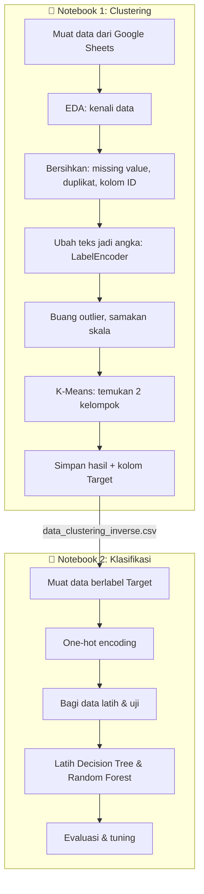

# Bab 1 — Tujuan Proyek

> **Inti bab ini:** proyek ini mengajarkan cara menggabungkan dua jenis machine learning. Pertama, mesin **menemukan kelompok sendiri** dari data tanpa label. Kedua, mesin **belajar mengenali kelompok itu** supaya bisa memberi label pada data baru.

---

## 1.1 Masalah yang Ingin Diselesaikan

Bayangkan kamu bekerja di sebuah bank. Kamu punya ribuan catatan transaksi: berapa nominalnya, di kota mana, lewat ATM atau online, usia nasabahnya, berapa saldonya, dan seterusnya.

Tapi ada satu hal yang **tidak** kamu punya: **label**. Tidak ada kolom yang bilang *"nasabah ini tipe A"* atau *"transaksi ini mencurigakan"*. Datanya hanya berupa angka dan teks mentah.

Pertanyaannya:

1. **Apakah nasabah-nasabah ini bisa dikelompokkan secara alami?** Misalnya ada kelompok yang mirip satu sama lain.
2. **Kalau besok ada nasabah baru, dia masuk kelompok mana?**

Pertanyaan pertama dijawab dengan **clustering**. Pertanyaan kedua dijawab dengan **klasifikasi**.

---

## 1.2 Analogi Sederhana

Bayangkan kamu diberi **tumpukan 2.000 surat tanpa alamat tujuan**.

- **Tahap 1 (Clustering):** kamu memilah surat-surat itu menjadi tumpukan berdasarkan kemiripan — ukuran amplop, warna, tulisan tangan. Kamu tidak tahu "nama" tiap tumpukan; kamu cuma tahu surat di satu tumpukan mirip satu sama lain. Kamu lalu menempelkan stiker: *Tumpukan 0* dan *Tumpukan 1*.
- **Tahap 2 (Klasifikasi):** kamu melatih seorang asisten dengan menunjukkan surat-surat yang sudah berstiker. Setelah belajar, asisten bisa memasukkan **surat baru** ke tumpukan yang benar tanpa bantuanmu.

Itulah persis yang dilakukan proyek ini, hanya saja "surat" diganti dengan "transaksi bank".

---

## 1.3 Alur Besar Proyek

Perhatikan panah di antara kedua notebook: **output notebook pertama menjadi input notebook kedua**. Inilah "integrasi" unsupervised dan supervised learning yang menjadi tujuan utama kelas ini.

---

## 1.4 Tujuan Pembelajaran (dari Sisi Kelas Dicoding)

Proyek ini adalah submission akhir kelas *Belajar Machine Learning untuk Pemula*. Tujuan kelasnya adalah membuktikan bahwa kamu bisa:

| Kemampuan | Di mana dipraktikkan |
|-----------|----------------------|
| Memuat dan menjelajahi data (EDA) | Notebook Clustering, Kriteria 1 |
| Membersihkan dan menyiapkan data | Notebook Clustering, Kriteria 2 |
| Membangun model *unsupervised* (K-Means) | Notebook Clustering, Kriteria 3 |
| Menafsirkan hasil clustering | Notebook Clustering, Kriteria 4 |
| Membangun model *supervised* (klasifikasi) | Notebook Klasifikasi, Kriteria 5 |

Setiap kriteria punya tingkatan **Basic → Skilled → Advanced**. Proyek ini mengerjakan semuanya sampai **Advanced**.

---

## 1.5 Apa yang Dihasilkan Proyek Ini

| Berkas | Isi | Dibuat di |
|--------|-----|-----------|
| `model_clustering.h5` | Model K-Means (2 cluster) | Notebook Clustering |
| `PCA_model_clustering.h5` | Model K-Means yang dilatih pada data hasil PCA | Notebook Clustering |
| `data_clustering.csv` | Data yang sudah diproses (angka ter-*scale*) + kolom `Target` | Notebook Clustering |
| `data_clustering_inverse.csv` | Data yang dikembalikan ke nilai asli + kolom `Target` | Notebook Clustering |
| `decision_tree_model.h5` | Model Decision Tree | Notebook Klasifikasi |
| `explore_RandomForest_classification.h5` | Model Random Forest | Notebook Klasifikasi |
| `tuning_classification.h5` | Random Forest hasil *hyperparameter tuning* | Notebook Klasifikasi |

> 💡 Meskipun berakhiran `.h5`, berkas-berkas ini **bukan** format HDF5. Isinya adalah objek Python yang disimpan dengan `joblib` (berbasis *pickle*). Akhiran `.h5` hanyalah konvensi penamaan dari kelas. Penjelasan lengkapnya ada di [Bab 3](03-alat-dan-lingkungan.md).

---

## 1.6 Apa yang **Tidak** Dilakukan Proyek Ini

Ini penting untuk dipahami supaya kamu tidak salah menjelaskan proyekmu sendiri.

**❌ Proyek ini tidak mendeteksi penipuan (fraud).**
Dataset aslinya bernama *Bank Transaction Dataset for Fraud Detection*, tapi di dalamnya **tidak ada kolom yang menandai transaksi sebagai fraud atau bukan**. Proyek ini hanya mengelompokkan transaksi. Bahkan, seperti yang akan kamu lihat di Bab 5, langkah pembuangan *outlier* justru **membuang transaksi yang paling mencurigakan** (nominal sangat besar dan percobaan login berulang).

**❌ Label `Target` bukan "kebenaran" dari dunia nyata.**
Label itu dibuat oleh K-Means. Jadi model klasifikasi tidak belajar "fakta tentang nasabah"; ia belajar **meniru keputusan K-Means**. Konsekuensinya dibahas di Bab 6 dan 7.

**❌ Tahap klasifikasi sebenarnya tidak wajib secara teknis.**
K-Means sendiri sudah bisa memberi label pada data baru lewat `model.predict()` (cukup cari pusat cluster terdekat). Tahap klasifikasi di proyek ini ada untuk **tujuan belajar**: melatih kemampuan membangun dan mengevaluasi model supervised. Dalam praktik, model klasifikasi seperti Decision Tree tetap berguna karena aturannya bisa dibaca manusia ("jika kota = X, maka kelompok 1").

---

## 1.7 Ringkasan Hasil (dan Sebuah Peringatan)

| Hasil | Nilai |
|-------|-------|
| Jumlah data setelah dibersihkan | 1.945 baris |
| Jumlah cluster terpilih | 2 |
| Silhouette Score | 0,572 |
| Ukuran cluster | 980 dan 965 |
| Akurasi Decision Tree / Random Forest / hasil tuning | 100% |

Angka-angka itu terlihat sangat bagus. **Tapi** di [Bab 6](06-membaca-hasil-cluster-dengan-jujur.md) kita akan membuktikan bahwa kedua cluster ternyata hanya membagi nasabah berdasarkan **urutan abjad nama kota** — dan itulah alasan akurasi klasifikasinya sempurna.

Memahami *kenapa* itu terjadi adalah pelajaran terpenting dari seluruh proyek ini.

---

**Selanjutnya:** [Bab 2 — Fondasi Machine Learning →](02-fondasi-machine-learning.md)
