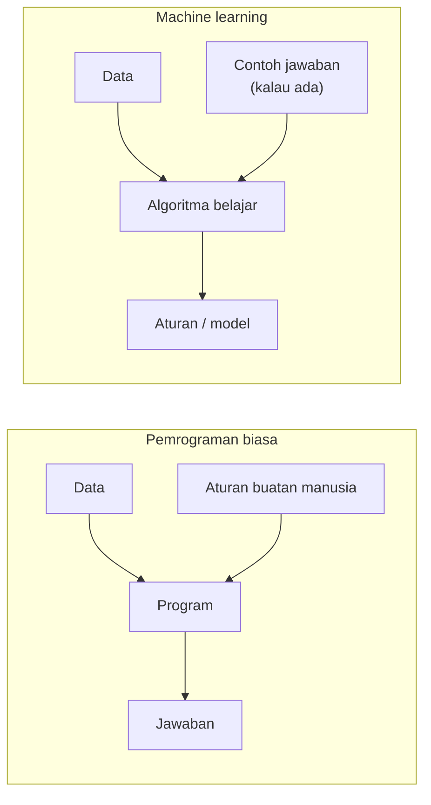
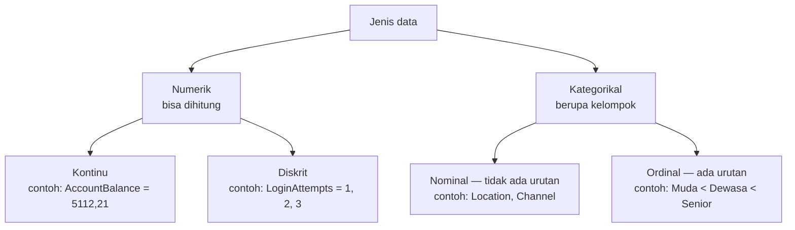
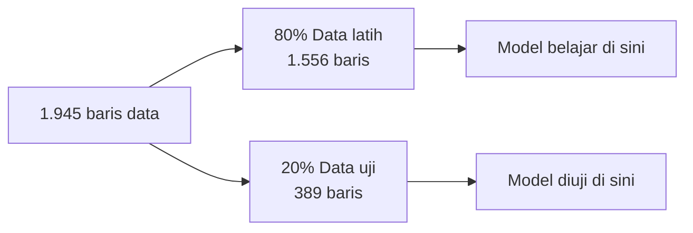
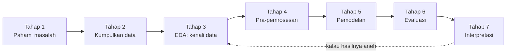

# Bab 2 — Fondasi Machine Learning

> **Inti bab ini:** sebelum membedah notebook, kita perlu bahasa yang sama. Bab ini menjelaskan konsep paling dasar yang dipakai di seluruh proyek — dimulai dari "apa itu machine learning".

---

## 2.1 Apa Itu Machine Learning?

Dalam pemrograman biasa, **kamu** yang menulis aturannya:

```
JIKA saldo < 1000 DAN usia < 25 MAKA kelompok = "nasabah muda"
```

Dalam machine learning, kamu memberi **data**, lalu **mesin yang mencari aturannya sendiri**.



Hasil dari proses belajar itu disebut **model**. Model adalah "aturan" yang disimpan dalam bentuk angka-angka, lalu bisa dipakai untuk data baru.

---

## 2.2 Data Tabular: Baris, Kolom, Fitur, Label

Data di proyek ini berbentuk **tabel**, seperti spreadsheet Excel.

| TransactionAmount | CustomerAge | Channel | AccountBalance | Target |
|---:|---:|:---|---:|:---:|
| 14,09 | 70 | ATM | 5.112,21 | 1 |
| 376,24 | 68 | ATM | 13.758,91 | 0 |
| 126,29 | 19 | Online | 1.122,35 | 1 |

*(Tiga baris pertama asli dari `data_clustering_inverse.csv`.)*

- **Baris** = satu **observasi** (di sini: satu transaksi).
- **Kolom** = satu **atribut**.
- **Fitur** (*feature*, sering ditulis **X**) = kolom yang dipakai sebagai **masukan** model.
- **Label / target** (sering ditulis **y**) = kolom yang ingin **ditebak**. Di proyek ini namanya `Target`.

> 📌 Di awal proyek, kolom `Target` **belum ada**. Kolom itu baru diciptakan oleh K-Means di Notebook Clustering.

---

## 2.3 Jenis-Jenis Data

Mengenali jenis data itu penting karena **setiap jenis butuh perlakuan berbeda**.



**Kenapa ini penting?** Algoritma machine learning hanya mengerti **angka**. Jadi data kategorikal harus diubah menjadi angka (*encoding*). Cara mengubahnya **harus sesuai jenisnya**:

- Kategori **ordinal** boleh diubah jadi 0, 1, 2 karena memang ada urutannya.
- Kategori **nominal** *seharusnya* tidak diubah jadi 0, 1, 2, …, karena angka itu menyiratkan urutan dan jarak yang sebenarnya tidak ada. (Apakah "Boston" lebih besar dari "Atlanta"? Tidak masuk akal.)

Simpan poin kedua ini baik-baik — **ini adalah akar masalah terbesar di proyek ini** (Bab 6).

---

## 2.4 Supervised vs Unsupervised Learning

| | **Supervised Learning** | **Unsupervised Learning** |
|---|---|---|
| Ada label? | ✅ Ya | ❌ Tidak |
| Tujuan | Menebak label untuk data baru | Menemukan pola/struktur tersembunyi |
| Analogi | Belajar dengan kunci jawaban | Belajar tanpa kunci jawaban |
| Contoh tugas | Klasifikasi, regresi | Clustering, reduksi dimensi |
| Di proyek ini | Decision Tree, Random Forest | K-Means, PCA |

Dua jenis tugas supervised:
- **Klasifikasi** — menebak **kategori** (contoh: cluster 0 atau 1).
- **Regresi** — menebak **angka** (contoh: berapa saldo bulan depan). *Tidak dipakai di proyek ini.*

Dua jenis tugas unsupervised yang dipakai:
- **Clustering** — mengelompokkan data yang mirip (K-Means).
- **Reduksi dimensi** — meringkas banyak kolom menjadi sedikit kolom (PCA), misalnya supaya bisa digambar di grafik 2D.

---

## 2.5 Kemiripan = Jarak

Bagaimana mesin tahu dua nasabah itu "mirip"? Jawabannya: dengan **mengukur jarak** antar baris data, seolah-olah setiap baris adalah titik di dalam ruang.

Jarak yang paling umum adalah **jarak Euclidean** (jarak garis lurus):

$$
d(A, B) = \sqrt{(a_1 - b_1)^2 + (a_2 - b_2)^2 + \dots + (a_n - b_n)^2}
$$

K-Means memakai jarak ini. Semakin kecil jaraknya, semakin mirip.

### Kenapa skala sangat penting

Lihat dua nasabah ini:

| | Usia | Saldo |
|---|---:|---:|
| Nasabah C | 25 | 2.000 |
| Nasabah D | 70 | 2.500 |

Secara akal sehat, keduanya **sangat berbeda** (umurnya terpaut 45 tahun), sedangkan saldonya hampir sama.

**Tanpa penyamaan skala:**

$$
d = \sqrt{45^2 + 500^2} = \sqrt{2025 + 250000} \approx 502
$$

Selisih saldo (500) **mendominasi** jarak hanya karena angkanya besar, padahal 500 itu kecil untuk ukuran saldo. Selisih umur nyaris tidak dihitung.

**Setelah penyamaan skala** (membagi dengan standar deviasi; usia σ = 17,74 dan saldo σ = 3.906,15 di data ini):

$$
d = \sqrt{\left(\tfrac{45}{17{,}74}\right)^2 + \left(\tfrac{500}{3906{,}15}\right)^2} = \sqrt{2{,}537^2 + 0{,}128^2} \approx 2{,}54
$$

Sekarang umur yang mendominasi — sesuai akal sehat. **Inilah alasan langkah `StandardScaler` ada.** Fitur dengan angka besar akan "berteriak lebih keras" kalau tidak diskalakan.

> ⚠️ Ingat prinsip ini: **fitur yang rentang angkanya paling lebar akan menguasai jarak.** Di Bab 6 kita akan melihat satu fitur yang lolos dari penskalaan dan akhirnya menguasai seluruh hasil clustering.

---

## 2.6 Data Latih, Data Uji, dan Generalisasi

Model supervised dilatih dengan data, lalu diuji dengan data **yang belum pernah dilihatnya**.



Kenapa harus dipisah? Bayangkan ujian sekolah:
- Kalau soal ujian **sama persis** dengan soal latihan, nilai 100 tidak membuktikan apa-apa — mungkin muridnya cuma menghafal.
- Kalau soal ujian **baru**, nilai bagus membuktikan murid benar-benar paham.

Kemampuan model bekerja baik pada data baru disebut **generalisasi**.

### Overfitting dan Underfitting

| | Arti | Analogi |
|---|---|---|
| **Overfitting** | Model terlalu menghafal data latih, gagal di data baru | Murid hafal kunci jawaban, bingung saat soalnya diubah sedikit |
| **Underfitting** | Model terlalu sederhana, gagal bahkan di data latih | Murid tidak belajar sama sekali |
| **Pas (good fit)** | Bagus di data latih **dan** data uji | Murid paham konsepnya |

---

## 2.7 Bagaimana Menilai Model?

Cara menilai berbeda tergantung jenis tugasnya:

| Jenis tugas | Ada jawaban pembanding? | Metrik di proyek ini |
|---|---|---|
| Clustering (unsupervised) | ❌ Tidak | **Silhouette Score** — seberapa rapat & terpisah cluster-nya |
| Klasifikasi (supervised) | ✅ Ya (`Target`) | **Akurasi, Precision, Recall, F1-Score** |

Detail rumus setiap metrik dijelaskan di Bab 5 (Silhouette) dan Bab 7 (metrik klasifikasi).

> 💡 **Pelajaran penting:** metrik clustering hanya mengukur **bentuk geometris** kelompok, bukan **apakah kelompok itu bermakna**. Silhouette tinggi tidak otomatis berarti cluster-nya berguna. Kita akan melihat bukti nyatanya di Bab 6.

---

## 2.8 Alur Kerja Machine Learning Secara Umum

Hampir semua proyek ML mengikuti pola yang sama, dan proyek ini juga:



Perhatikan panah putus-putus di akhir: **interpretasi sering memaksa kita kembali ke awal**. Itulah yang terjadi ketika kita menyelidiki hasil proyek ini di Bab 6 dan Bab 8.

---

**← Sebelumnya:** [Bab 1 — Tujuan Proyek](01-tujuan-proyek.md) · **Selanjutnya:** [Bab 3 — Alat dan Lingkungan →](03-alat-dan-lingkungan.md)
