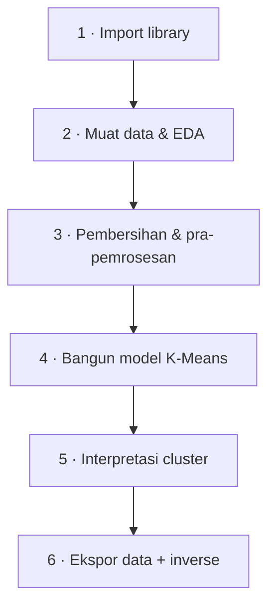
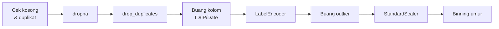
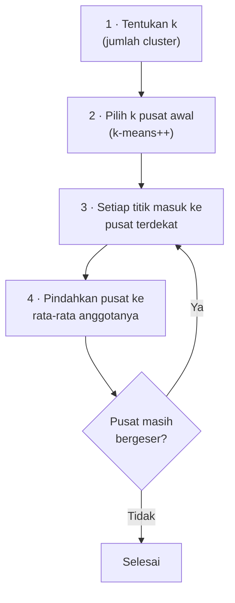

# Bab 5 — Bedah Notebook Clustering

> **Inti bab ini:** kita menyusuri notebook `[Clustering]_Submission_Akhir_BMLP_Andi_Arif_Abdillah.ipynb` dari sel pertama sampai terakhir. Untuk setiap langkah: **apa** yang dilakukan, **kenapa**, **hasil nyatanya**, dan **catatan kritis** kalau ada.

Buka notebook-nya di sebelah bab ini supaya bisa mencocokkan.

---

## 5.0 Aturan Main Template

Notebook ini memakai template *Fill in the Blanks* dari Dicoding. Aturannya:

- Hanya mengisi bagian yang ditandai `________`.
- **Semua `import` hanya di sel pertama.** Import di sel lain → submission ditolak.
- Variabel data harus bernama **`df`** dari awal sampai akhir.
- Di Kriteria 1, **jangan** pakai `print(df.head())` atau `display(...)` — cukup `df.head()`. Jupyter otomatis menampilkan nilai baris terakhir sebuah sel sebagai tabel yang rapi; `print()` justru mengubahnya jadi teks polos.

Alur keseluruhan notebook:



---

## Bagian 1 — Import Library

```python
import pandas as pd
import numpy as np
import matplotlib.pyplot as plt
import seaborn as sns
from sklearn.preprocessing import LabelEncoder, StandardScaler
from sklearn.cluster import KMeans
from sklearn.decomposition import PCA
from sklearn.metrics import silhouette_score
from yellowbrick.cluster import KElbowVisualizer
import joblib
```

Setiap baris memuat "alat" yang nanti dipakai. Peran masing-masing ada di [Bab 3](03-alat-dan-lingkungan.md#32-library-yang-dipakai). Singkatan `pd`, `np`, `plt`, `sns` adalah konvensi umum di komunitas Python.

---

## Bagian 2 — Memuat Data dan EDA

### 2.1 Memuat data

```python
url = 'https://docs.google.com/spreadsheets/...pub?output=csv'
df = pd.read_csv(url)
```

`pd.read_csv` bisa membaca langsung dari internet. `output=csv` di ujung URL membuat Google Sheets mengirim isinya dalam format CSV. Hasilnya: **2.537 baris × 16 kolom**.

### 2.2 `df.head()`, `df.info()`, `df.describe()`

| Perintah | Menampilkan | Kegunaan |
|---|---|---|
| `df.head()` | 5 baris pertama | Melihat wujud data |
| `df.info()` | Nama kolom, jumlah nilai tidak kosong, tipe data | Mendeteksi data hilang & tipe yang salah |
| `df.describe()` | Statistik kolom numerik (mean, std, min, kuartil, max) | Melihat sebaran & kemungkinan outlier |

Dari `info()` kita langsung tahu ada data hilang, karena jumlah *non-null* setiap kolom kurang dari 2.537. Angka lengkapnya dibahas di [Bab 4](04-mengenal-dataset.md#43-kondisi-data-mentah).

### 2.3 Matriks korelasi (Skilled)

```python
numerical_cols = df.select_dtypes(include=['number']).columns
correlation = df[numerical_cols].corr()
sns.heatmap(correlation, annot=True, cmap='coolwarm', fmt=".2f", vmin=-1, vmax=1)
```

- `numerical_cols` berisi 5 kolom: `TransactionAmount`, `CustomerAge`, `TransactionDuration`, `LoginAttempts`, `AccountBalance`.
- **Variabel ini penting** — dipakai lagi di tahap outlier, scaling, agregasi, dan inverse.
- `.corr()` menghitung korelasi Pearson antar kolom. `heatmap` mewarnainya: merah = positif, biru = negatif.
- **Hasil:** satu-satunya hubungan yang berarti adalah `CustomerAge`–`AccountBalance` (0,32).

### 2.4 Histogram (Skilled)

```python
fig, axes = plt.subplots(2, 3, figsize=(18, 8))
axes = axes.flatten()
for i, column in enumerate(numerical_cols):
    sns.histplot(df[column], bins=20, kde=True, color='skyblue', ax=axes[i])
```

- `plt.subplots(2, 3)` membuat kisi 2 baris × 3 kolom = **6 kotak grafik**. Karena hanya ada 5 kolom numerik, **kotak ke-6 kosong** — itu normal.
- `axes.flatten()` mengubah kisi 2×3 menjadi daftar 6 kotak supaya bisa dipanggil `axes[0]`, `axes[1]`, …
- `ax=axes[i]` memastikan histogram ke-*i* digambar di kotak ke-*i*. Tanpa ini, semua histogram akan menumpuk di satu tempat.
- `kde=True` menambahkan garis halus perkiraan bentuk sebaran.
- **Yang terlihat:** `TransactionAmount` miring ke kanan, `LoginAttempts` hampir semuanya menumpuk di angka 1.

### 2.5 Boxplot (Advanced)

```python
sns.boxplot(x='CustomerOccupation', y='TransactionAmount', data=df)
plt.xticks(rotation=45)
```

Boxplot menampilkan sebaran nominal transaksi untuk tiap profesi. `rotation=45` memutar label sumbu-x supaya tidak bertumpuk — syarat kriteria Advanced ("visualisasi tidak overlap").

**Cara membaca boxplot:**

```
   o      ← titik di luar "kumis" = calon outlier
   |      ← kumis atas (sampai data terjauh yang masih ≤ Q3 + 1,5×IQR)
 ┌───┐    ← Q3 (75%)
 │───│    ← median (50%)
 └───┘    ← Q1 (25%)
   |      ← kumis bawah (sampai data terjauh yang masih ≥ Q1 − 1,5×IQR)
```

---

## Bagian 3 — Pembersihan dan Pra-Pemrosesan

Urutan langkah di bagian ini **tidak boleh sembarangan**:



| Tahap | Jumlah baris | Berubah |
|---|---:|---:|
| Data mentah | 2.537 | — |
| Setelah `dropna` | 2.156 | −381 |
| Setelah `drop_duplicates` | 2.135 | −21 |
| Setelah buang outlier | **1.945** | −190 |

Totalnya **592 baris (±23%) hilang** sebelum pemodelan.

### 3.1 Cek data kosong dan duplikat

```python
df.isnull().sum()       # jumlah sel kosong per kolom
df.duplicated().sum()   # jumlah baris yang persis sama dengan baris lain → 21
```

- `isnull()` menghasilkan tabel True/False (True = kosong). `.sum()` menjumlahkan True per kolom (True dihitung 1).
- `duplicated()` menandai baris yang isinya **identik** dengan baris sebelumnya. Hasil **21** sama persis dengan output yang diharapkan template.

### 3.2 Menangani data kosong

```python
df.dropna(inplace=True)
df.isnull().sum()       # semua jadi 0
```

- `dropna()` menghapus **seluruh baris** yang punya minimal satu sel kosong → 381 baris hilang.
- `inplace=True` artinya `df` langsung diubah. Tanpa itu, pandas hanya mengembalikan salinan dan `df` tidak berubah — kesalahan klasik pemula.

> 🤔 **Catatan kritis:** membuang 15% data itu mahal. Alternatifnya adalah **imputasi** (mengisi sel kosong dengan median/modus). Template ini memilih `dropna` karena paling sederhana. Di dunia nyata, keputusan ini perlu dipertimbangkan.

### 3.3 Menghapus duplikat

```python
df.drop_duplicates(inplace=True)
df.duplicated().sum()   # 0
```

Duplikat bisa membuat model "menganggap" sebuah pola lebih penting dari seharusnya karena terhitung berkali-kali.

### 3.4 Membuang kolom ID, IP, dan tanggal

```python
cols_to_drop = [col for col in df.columns if
                'id' in col.lower() or
                'ip' in col.lower() or
                'date' in col.lower()]
df = df.drop(columns=cols_to_drop)
```

**Cara kerja *list comprehension* ini:** untuk setiap nama kolom, ubah ke huruf kecil (`.lower()`), lalu cek apakah mengandung `'id'`, `'ip'`, atau `'date'`. Yang terhapus (7 kolom):

`TransactionID`, `AccountID`, `PreviousTransactionDate`, `DeviceID`, `IP Address`, `MerchantID`, `TransactionDate`

**Kenapa dibuang?**
- **ID** itu unik untuk setiap baris/akun. Model tidak bisa belajar pola umum dari kode acak seperti `TX000123`.
- **Tanggal** dalam bentuk teks mentah tidak bisa langsung dipakai. Perlu diolah dulu (misalnya jadi "jam transaksi" atau "jarak hari dari transaksi sebelumnya") — proyek ini memilih membuangnya.

> 🤔 **Catatan kritis:** pencocokan substring itu rawan. Kolom bernama `Residence` atau `Paid` akan **ikut terhapus** karena mengandung "id". Di dataset ini kebetulan tidak ada kolom seperti itu, tapi lebih aman menyebut nama kolom secara eksplisit.

### 3.5 LabelEncoder: mengubah teks menjadi angka

```python
categorical_cols = list(df.select_dtypes(include=['object']).columns)
encoders = {}
for column in categorical_cols:
    label_encoder = LabelEncoder()
    df[column] = label_encoder.fit_transform(df[column])
    encoders[column] = label_encoder
```

`LabelEncoder` mengurutkan kategori **sesuai abjad** lalu memberi nomor mulai 0:

| Kolom | Kode |
|---|---|
| TransactionType | Credit = 0, Debit = 1 |
| Channel | ATM = 0, Branch = 1, Online = 2 |
| CustomerOccupation | Doctor = 0, Engineer = 1, Retired = 2, Student = 3 |
| Location | Albuquerque = 0, Atlanta = 1, … , Louisville = 21, Memphis = 22, … , Washington = **42** |

Setiap encoder disimpan di dictionary `encoders`, karena nanti dipakai lagi untuk mengembalikan angka ke teks (`inverse_transform`).

> ⚠️ **Catatan kritis — ini benih masalah terbesar proyek.**
> Semua kolom ini bersifat **nominal** (tidak punya urutan). Tapi setelah di-encode, K-Means akan menganggap angkanya punya **jarak**: Washington (42) dianggap "42 satuan" jauhnya dari Albuquerque (0), sedangkan selisih `Channel` paling banyak cuma 2.
> Akibatnya, `Location` dengan rentang 0–42 akan jauh lebih "berat" daripada fitur lain. Lihat Bab 6.

### 3.6 Cek ulang daftar kolom

```python
df.columns.tolist()
```

Sisa 9 kolom: `TransactionAmount`, `TransactionType`, `Location`, `Channel`, `CustomerAge`, `CustomerOccupation`, `TransactionDuration`, `LoginAttempts`, `AccountBalance`.

### 3.7 Membuang outlier dengan metode IQR (Skilled)

```python
for col in numerical_cols:
    Q1 = df[col].quantile(0.25)
    Q3 = df[col].quantile(0.75)
    IQR = Q3 - Q1
    lower_bound = Q1 - 1.5 * IQR
    upper_bound = Q3 + 1.5 * IQR
    df = df[(df[col] >= lower_bound) & (df[col] <= upper_bound)]
```

**Konsepnya:**
- **Q1** (kuartil 1) = nilai yang lebih besar dari 25% data.
- **Q3** (kuartil 3) = nilai yang lebih besar dari 75% data.
- **IQR** = Q3 − Q1 = lebar "setengah data bagian tengah".
- Data di luar rentang $[Q_1 - 1{,}5 \times IQR,\; Q_3 + 1{,}5 \times IQR]$ dianggap **outlier** (pencilan) dan dibuang.

**Hasil nyata di proyek ini** (dihitung berurutan, kolom demi kolom):

| Kolom | Q1 | Q3 | IQR | Batas bawah | Batas atas | Dibuang |
|---|---:|---:|---:|---:|---:|---:|
| TransactionAmount | 83,04 | 414,63 | 331,59 | −414,33 | 912,01 | **93** |
| CustomerAge | 27 | 59 | 32 | −21 | 107 | 0 |
| TransactionDuration | 63 | 162 | 99 | −85,5 | 310,5 | 0 |
| LoginAttempts | 1 | 1 | **0** | 1 | 1 | **97** |
| AccountBalance | 1.488,65 | 7.659,99 | 6.171,34 | −7.768,36 | 16.917,00 | 0 |

Perhatikan `LoginAttempts`: karena lebih dari 75% nilainya adalah 1, maka Q1 = Q3 = 1 dan **IQR = 0**. Batasnya jadi [1, 1], sehingga **semua** transaksi dengan 2–5 percobaan login dibuang. Setelah ini, `LoginAttempts` bernilai 1 untuk semua baris — kolomnya jadi **tidak berguna** (konstan).

> ⚠️ **Catatan kritis — ironi terbesar proyek.**
> Dataset ini berjudul *Fraud Detection*. Dalam konteks penipuan, **transaksi bernominal sangat besar** dan **percobaan login berulang** adalah sinyal yang **paling mencurigakan**. Langkah ini membuang tepat 190 transaksi seperti itu.
> Outlier bukan selalu "sampah". Kadang outlier justru **hal yang sedang kita cari**.

### 3.8 Penskalaan dengan StandardScaler (Skilled)

```python
scaler = StandardScaler()
df[numerical_cols] = scaler.fit_transform(df[numerical_cols])
```

StandardScaler mengubah setiap nilai menjadi **z-score**:

$$
z = \frac{x - \mu}{\sigma}
$$

dengan $\mu$ = rata-rata dan $\sigma$ = standar deviasi kolom tersebut. Setelah diubah, setiap kolom punya rata-rata 0 dan standar deviasi 1.

Nilai yang dipelajari `scaler` dari data ini:

| Kolom | μ (rata-rata) | σ (std) |
|---|---:|---:|
| TransactionAmount | 256,84 | 218,31 |
| CustomerAge | 44,69 | 17,74 |
| TransactionDuration | 119,23 | 70,58 |
| LoginAttempts | 1,00 | 1,00 *(lihat catatan)* |
| AccountBalance | 5.100,81 | 3.906,15 |

**Contoh perhitungan:** baris pertama punya `TransactionAmount` = 14,09.

$$
z = \frac{14{,}09 - 256{,}84}{218{,}31} = -1{,}112
$$

Nilai −1,112 artinya "sekitar 1,1 standar deviasi di **bawah** rata-rata". Angka ini persis yang tersimpan di `data_clustering.csv`.

> 💡 `LoginAttempts` sudah konstan (σ sebenarnya 0). Membagi dengan 0 itu tidak mungkin, jadi scikit-learn diam-diam memakai σ = 1. Hasilnya semua nilai menjadi (1 − 1) / 1 = **0**.

> ⚠️ **Catatan kritis:** `scaler` **hanya** diterapkan ke `numerical_cols` (5 kolom). Kolom hasil LabelEncoder — termasuk `Location` dengan nilai 0–42 — **tidak ikut diskalakan**. Ini adalah langkah kedua yang menyebabkan masalah di Bab 6.

### 3.9 Binning umur (Advanced)

```python
df['CustomerAge_Group'] = pd.qcut(df['CustomerAge'], q=3,
                                  labels=['Muda', 'Dewasa', 'Senior'], duplicates='drop')
label_encoder = LabelEncoder()
df['CustomerAge_Group'] = label_encoder.fit_transform(df['CustomerAge_Group'])
encoders['CustomerAge_Group'] = label_encoder
categorical_cols.extend(['CustomerAge_Group'])
```

- **Binning** = mengubah angka kontinu menjadi kelompok.
- `pd.qcut(q=3)` membagi data menjadi 3 kelompok yang **jumlah anggotanya hampir sama** (berdasarkan kuantil), bukan rentang umur yang sama lebar.
- Hasil dalam satuan umur asli:

| Kelompok | Rentang umur | Jumlah |
|---|---|---:|
| Muda | 18–32 | 669 |
| Dewasa | 33–55 | 639 |
| Senior | 56–80 | 637 |

- `qcut` tetap berhasil walaupun `CustomerAge` sudah diskalakan, karena kuantil tidak terpengaruh penskalaan (urutannya tetap sama).
- Kolom baru ditambahkan ke `categorical_cols` supaya ikut dikembalikan ke teks saat *inverse*.

> ⚠️ **Catatan kritis:** LabelEncoder mengurutkan abjad, jadi kodenya menjadi **Dewasa = 0, Muda = 1, Senior = 2**. Urutan alami (Muda < Dewasa < Senior) **rusak**. Untuk data **ordinal**, alat yang tepat adalah `OrdinalEncoder(categories=[['Muda','Dewasa','Senior']])` — tapi template tidak mengizinkan import tambahan.

---

## Bagian 4 — Membangun Model Clustering

### 4.1 Salinan data untuk clustering

```python
df_used = df.copy()
df_used.describe()
```

`df_used` adalah salinan `df`. Nanti kolom hasil cluster ditambahkan ke `df_used`, sehingga `df` tetap "bersih" untuk dipakai melatih model. `.copy()` penting: tanpa itu, kedua variabel menunjuk ke **data yang sama**, dan mengubah salah satu akan ikut mengubah yang lain.

### 4.2 Cara kerja K-Means

K-Means mencari **k titik pusat** (*centroid*) sehingga setiap titik data dekat dengan pusat cluster-nya.



Yang diminimalkan K-Means disebut **inertia** — jumlah kuadrat jarak setiap titik ke pusat cluster-nya:

$$
\text{inertia} = \sum_{i=1}^{n} \lVert x_i - \mu_{c(i)} \rVert^2
$$

- **k-means++** memilih pusat awal yang saling berjauhan, supaya hasilnya lebih stabil daripada pusat acak murni.
- `random_state=42` mengunci keacakan supaya hasilnya **sama setiap kali dijalankan**. Angka 42 tidak istimewa — itu hanya konvensi populer.

> ⚠️ K-Means memakai **jarak Euclidean**. Jadi semua yang dibahas di [Bab 2.5](02-fondasi-machine-learning.md#25-kemiripan--jarak) tentang skala berlaku penuh di sini.

### 4.3 Memilih jumlah cluster: Elbow Method dengan KElbowVisualizer

```python
model = KMeans()
visualizer = KElbowVisualizer(model, k=(2, 10), metric='silhouette', timings=False)
visualizer.fit(df)
visualizer.show()
```

- `k=(2, 10)` menguji **k = 2 sampai 9** (angka 10 tidak termasuk, seperti `range(2, 10)` di Python).
- `metric='silhouette'` artinya setiap k dinilai dengan Silhouette Score (penjelasannya di 4.6). Semakin tinggi semakin baik.
- Metode *elbow* klasik memakai **inertia**: kita mencari "siku" di grafik, yaitu titik ketika menambah cluster tidak lagi menurunkan inertia secara signifikan.

Hasil untuk setiap k (dihitung ulang dengan `random_state=42`):

| k | Silhouette | Inertia |
|---:|---:|---:|
| **2** | **0,572** | 87.891 |
| 3 | 0,496 | 46.770 |
| 4 | 0,442 | 31.494 |
| 5 | 0,393 | 24.796 |
| 6 | 0,342 | 21.435 |
| 7 | 0,305 | 18.931 |
| 8 | 0,260 | 17.930 |
| 9 | 0,236 | 17.036 |

Silhouette **tertinggi di k = 2** dan terus turun setelahnya → dipilih **k = 2**. Sel visualisasi PCA di template juga sudah mengisyaratkan 2 cluster (`n_colors=2`).

> 💡 Perhatikan inertia: turun dari 87.891 ke 46.770 saat k naik ke 3. Itu penurunan besar. Kalau memakai metode elbow berbasis inertia, k = 3 juga bisa jadi kandidat. Memilih k selalu melibatkan pertimbangan, bukan hanya satu angka.

### 4.4 Melatih K-Means

```python
model = KMeans(n_clusters=2, random_state=42)
model.fit(df)
```

Hasilnya: **980 baris di Cluster 0** dan **965 baris di Cluster 1**. Ukurannya hampir sama — sebuah petunjuk bahwa pembaginya mungkin "garis tengah" sesuatu (Bab 6).

### 4.5 Menyimpan model

```python
joblib.dump(model, "model_clustering.h5")
```

Menyimpan model yang sudah dilatih ke file supaya bisa dipakai lagi tanpa melatih ulang (dan supaya reviewer bisa menilainya otomatis).

### 4.6 Silhouette Score (Skilled)

```python
labels = model.labels_
score = silhouette_score(df, labels)
print("Silhouette Score:", score)      # 0.5719840690144938
```

`model.labels_` berisi nomor cluster (0 atau 1) untuk setiap baris.

**Cara menghitung Silhouette untuk satu titik *i*:**
- $a(i)$ = rata-rata jarak titik *i* ke semua titik lain **di cluster-nya sendiri** (seberapa rapat).
- $b(i)$ = rata-rata jarak titik *i* ke semua titik di **cluster terdekat lainnya** (seberapa terpisah).

$$
s(i) = \frac{b(i) - a(i)}{\max\big(a(i),\, b(i)\big)}
$$

| Nilai s(i) | Arti |
|---|---|
| Mendekati **+1** | Titik jauh dari cluster lain dan dekat dengan cluster sendiri ✅ |
| Sekitar **0** | Titik berada di perbatasan dua cluster |
| **Negatif** | Titik mungkin masuk cluster yang salah ❌ |

Silhouette Score = rata-rata $s(i)$ semua titik. Nilai **0,572** tergolong **cukup baik** secara geometris.

> ⚠️ Silhouette hanya mengukur **bentuk**: rapat dan terpisah. Ia tidak bisa tahu apakah pemisahnya **bermakna**. Di Bab 6 kita lihat contoh nyata silhouette tinggi untuk cluster yang tidak bermakna.

### 4.7 Visualisasi cluster dengan PCA (Skilled)

```python
pca = PCA(n_components=2)
df_pca = pca.fit_transform(df)
df_pca = pd.DataFrame(data=df_pca, columns=['Principal Component 1', 'Principal Component 2'])
df_pca['Cluster'] = labels
sns.scatterplot(x='Principal Component 1', y='Principal Component 2', hue='Cluster', ...)
```

**Masalahnya:** data kita punya 10 fitur (10 dimensi), sedangkan layar hanya 2 dimensi.

**PCA (Principal Component Analysis)** mencari arah-arah baru (*principal components*) yang menangkap **variasi data paling besar**, lalu memproyeksikan data ke 2 arah teratas. Bayangkan memotret benda 3D dari sudut yang memperlihatkan bentuknya paling jelas.

- `hue='Cluster'` mewarnai titik berdasarkan cluster.
- Tanda **X merah** adalah pusat cluster yang diproyeksikan dengan PCA yang sama (`pca.transform(model.cluster_centers_)`).

**Hasil penting:** komponen pertama menjelaskan **95,7%** variasi data, komponen kedua hanya **1,4%**. Artinya hampir seluruh variasi data terletak pada **satu arah** saja. Arah apa itu? Jawabannya di Bab 6.

### 4.8 Model K-Means pada data PCA (Advanced)

```python
pca = PCA(n_components=2)
df_pca_array = pca.fit_transform(df_used)
data_final = pd.DataFrame(data=df_pca_array, columns=['PCA1', 'PCA2'])
kmeans_pca = KMeans(n_clusters=2, random_state=42)
kmeans_pca.fit(data_final)
joblib.dump(kmeans_pca, "PCA_model_clustering.h5")
```

Di sini K-Means dilatih **hanya** pada 2 kolom hasil PCA, sebagai pembanding model utama. Hasilnya: pembagian cluster **100% sama** dengan model utama (980 dan 965). Wajar, karena PCA1 sudah membawa 95,7% informasi.

---

## Bagian 5 — Interpretasi Cluster

### 5.1 Agregasi per cluster

```python
df_used['Cluster'] = labels
agg_summary = df_used.groupby('Cluster')[numerical_cols].agg(['mean', 'min', 'max']).round(2).T
display(agg_summary)
```

- `groupby('Cluster')` memisahkan baris berdasarkan cluster.
- `[numerical_cols]` hanya mengambil 5 kolom numerik.
- `.agg(['mean','min','max'])` menghitung rata-rata, minimum, dan maksimum.
- `.T` (*transpose*) memutar tabel supaya fitur menjadi baris dan cluster menjadi kolom, sehingga lebih mudah dibandingkan.

Hasilnya (masih ter-*scale*):

| Fitur | Mean Cluster 0 | Mean Cluster 1 |
|---|---:|---:|
| TransactionAmount | −0,01 | 0,01 |
| CustomerAge | 0,02 | −0,02 |
| TransactionDuration | 0,03 | −0,03 |
| LoginAttempts | 0,00 | 0,00 |
| AccountBalance | 0,01 | −0,01 |

Semua mendekati 0. **Kelima fitur numerik nyaris identik di kedua cluster.**

> ⚠️ **Catatan kritis — titik buta.** Tabel ini hanya menampilkan `numerical_cols`, jadi `Location` (si pembeda sebenarnya) **tidak terlihat sama sekali**. Ketika semua fitur yang ditampilkan nyaris sama, seharusnya kita curiga: "lalu apa yang membedakan kedua cluster?" — bukan memaksakan persona.

### 5.2 Menulis analisis cluster

Template meminta analisis tertulis di sel *"⚠️ PERHATIAN: JAWAB DI BAWAH SINI"*. Analisis yang ditulis di notebook ini menyimpulkan persona *"Dewasa/Profesional"* vs *"Muda/Pelajar"*. **Kesimpulan itu keliru** — penjelasan lengkap dan koreksinya ada di [Bab 6](06-membaca-hasil-cluster-dengan-jujur.md).

---

## Bagian 6 — Ekspor Data dan Inverse

### 6.1 Memberi nama kolom `Target` dan menyimpan

```python
df_used.rename(columns={"Cluster": "Target"}, inplace=True)
df_used.to_csv('data_clustering.csv', index=False)
```

- Nama `Target` **wajib** karena Notebook Klasifikasi mencari kolom dengan nama itu.
- `index=False` supaya nomor baris pandas tidak ikut tersimpan sebagai kolom tambahan.

Isi `data_clustering.csv`: 1.945 baris × 11 kolom (10 fitur ter-encode/ter-scale + `Target`).

### 6.2 Inverse: mengembalikan ke nilai asli (Skilled)

```python
df_inverse = df_used.copy()
df_inverse[numerical_cols] = scaler.inverse_transform(df_inverse[numerical_cols])

for column in categorical_cols:
    encoder = encoders[column]
    df_inverse[column] = encoder.inverse_transform(df_inverse[column].astype(int))
```

- `scaler.inverse_transform` menjalankan rumus terbalik: $x = z \times \sigma + \mu$. Contoh: −1,112 × 218,31 + 256,84 ≈ **14,09** (kembali ke nilai asli; selisih kecil hanya karena pembulatan).
- `encoder.inverse_transform` mengubah kode kembali ke teks: 36 → `San Diego`.
- `.astype(int)` diperlukan karena encoder hanya menerima bilangan bulat sesuai kode yang dikenalnya.

**Kenapa perlu inverse?** Karena manusia tidak bisa menafsirkan "rata-rata saldo −0,01". Kita butuh "rata-rata saldo 5.142".

### 6.3 Agregasi setelah inverse

```python
agg_summary_num = df_inverse.groupby('Target')[numerical_cols].agg(['mean','min','max']).round(2).T
agg_summary_cat = df_inverse.groupby('Target')[categorical_cols].agg(lambda x: x.mode()[0]).round(2).T
```

- Untuk numerik: mean/min/max dalam satuan asli.
- Untuk kategorikal: **modus** (nilai yang paling sering muncul). `x.mode()[0]` mengambil modus pertama karena bisa saja ada lebih dari satu.

| | Cluster 0 | Cluster 1 |
|---|---|---|
| Rata-rata TransactionAmount | 255,55 | 258,15 |
| Rata-rata CustomerAge | 45,06 | 44,33 |
| Rata-rata AccountBalance | 5.142,17 | 5.058,81 |
| Modus **Location** | **Charlotte** | **Tucson** |
| Modus CustomerOccupation | Doctor | Student |
| Modus CustomerAge_Group | Dewasa | Muda |

Petunjuknya sebenarnya **sudah ada di tabel ini**: Charlotte (huruf C) vs Tucson (huruf T).

### 6.4 Menyimpan data inverse (Advanced)

```python
df_inverse.to_csv('data_clustering_inverse.csv', index=False)
```

File inilah yang dipakai Notebook Klasifikasi (aturan template: jika menerapkan kriteria Advanced di bagian interpretasi, klasifikasi wajib memakai data inverse).

---

## Ringkasan Bab 5

| Langkah | Tujuan | Masalah yang tersembunyi |
|---|---|---|
| `dropna` | Buang data kosong | 15% data hilang |
| Buang kolom ID | Hilangkan fitur tak bermakna | Pencocokan substring rawan |
| LabelEncoder | Teks → angka | Kategori nominal mendapat jarak palsu |
| Buang outlier | Bersihkan data ekstrem | Membuang sinyal fraud; LoginAttempts jadi konstan |
| StandardScaler | Samakan skala | **Hanya** kolom numerik; Location tetap 0–42 |
| Binning | Kelompokkan umur | Urutan Muda/Dewasa/Senior rusak |
| K-Means | Temukan kelompok | Didominasi fitur berskala terbesar |
| Agregasi | Tafsirkan cluster | Location tidak terlihat |

---

**← Sebelumnya:** [Bab 4 — Mengenal Dataset](04-mengenal-dataset.md) · **Selanjutnya:** [Bab 6 — Membaca Hasil Cluster dengan Jujur →](06-membaca-hasil-cluster-dengan-jujur.md)
