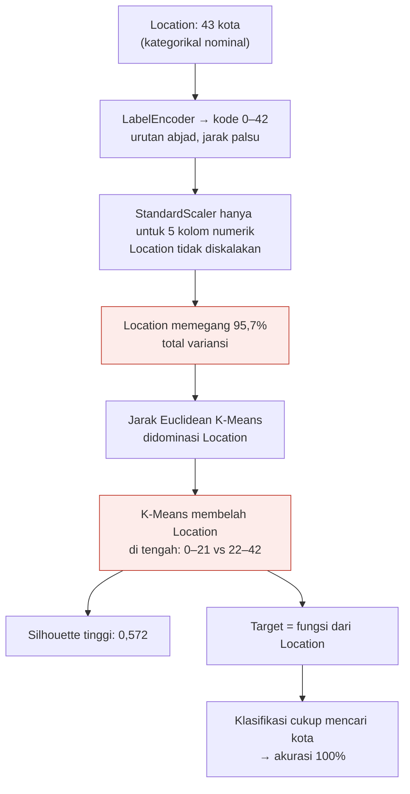

# Bab 6 — Membaca Hasil Cluster dengan Jujur

> **Inti bab ini:** kedua cluster di proyek ini **tidak** memisahkan nasabah berdasarkan perilaku, usia, atau profesi. Mereka memisahkan nasabah berdasarkan **urutan abjad nama kota**. Bab ini membuktikannya langkah demi langkah, menjelaskan kenapa itu terjadi, dan mengoreksi analisis yang tertulis di notebook.
>
> Ini bab paling penting di panduan ini. Kemampuan **meragukan hasil sendiri** adalah yang membedakan praktisi data yang baik dari yang sekadar bisa menjalankan kode.

---

## 6.1 Pertanyaan Detektif

Di akhir Bab 5 ada sesuatu yang janggal:

- Silhouette Score **0,572** → kedua cluster terpisah dengan **cukup jelas**.
- Tapi rata-rata kelima fitur numerik di kedua cluster **hampir identik** (selisih hanya 0,02–0,06 standar deviasi).

Kalau semua fitur yang kita lihat sama, **lalu apa yang memisahkan kedua cluster dengan begitu jelas?**

Mari kumpulkan bukti.

---

## 6.2 Bukti 1 — "Berat" Setiap Fitur

K-Means menghitung jarak Euclidean. Fitur dengan **sebaran (variansi) terbesar** akan paling menentukan jarak. Ini standar deviasi setiap fitur **tepat sebelum** K-Means dijalankan:

| Fitur | Standar deviasi | Variansi (std²) | Porsi dari total variansi |
|---|---:|---:|---:|
| **Location** | **12,33** | **152,0** | **95,7%** |
| CustomerOccupation | 1,14 | 1,3 | 0,8% |
| TransactionAmount | 1,00 | 1,0 | 0,6% |
| CustomerAge | 1,00 | 1,0 | 0,6% |
| TransactionDuration | 1,00 | 1,0 | 0,6% |
| AccountBalance | 1,00 | 1,0 | 0,6% |
| CustomerAge_Group | 0,81 | 0,7 | 0,4% |
| Channel | 0,80 | 0,6 | 0,4% |
| TransactionType | 0,42 | 0,2 | 0,1% |
| LoginAttempts | 0,00 | 0,0 | 0,0% |

**`Location` sendirian memegang 95,7% dari seluruh variansi data.** Kenapa? Karena kodenya 0–42 dan **tidak ikut diskalakan** (StandardScaler hanya diterapkan pada 5 kolom numerik). Fitur numerik yang sudah diskalakan masing-masing hanya punya std = 1.

Ingat contoh di [Bab 2.5](02-fondasi-machine-learning.md#25-kemiripan--jarak): fitur dengan angka paling besar "berteriak paling keras". Di sini `Location` berteriak 12 kali lebih keras daripada fitur lain.

---

## 6.3 Bukti 2 — Posisi Pusat Cluster

Ini koordinat pusat (*centroid*) kedua cluster yang ditemukan K-Means:

| Fitur | Pusat Cluster 0 | Pusat Cluster 1 | Selisih |
|---|---:|---:|---:|
| **Location** | **10,73** | **32,04** | **21,31** |
| CustomerOccupation | 1,46 | 1,55 | 0,09 |
| TransactionAmount | −0,01 | 0,01 | 0,02 |
| CustomerAge | 0,02 | −0,02 | 0,04 |
| TransactionDuration | 0,03 | −0,03 | 0,06 |
| AccountBalance | 0,01 | −0,01 | 0,02 |
| CustomerAge_Group | 0,99 | 1,01 | 0,02 |
| Channel | 0,98 | 0,97 | 0,01 |
| TransactionType | 0,78 | 0,77 | 0,01 |
| LoginAttempts | 0,00 | 0,00 | 0,00 |

Kedua pusat **hanya berbeda di satu dimensi**: `Location`. Di semua dimensi lain, keduanya praktis berada di titik yang sama.

---

## 6.4 Bukti 3 — Garis Pemisahnya Tepat di Tengah Abjad

Kalau dua pusat hanya berbeda di sumbu `Location`, maka garis pemisahnya ada di **titik tengah** keduanya:

$$
\frac{10{,}73 + 32{,}04}{2} \approx 21{,}4
$$

Setiap transaksi dengan kode `Location` ≤ 21 lebih dekat ke pusat Cluster 0; kode ≥ 22 lebih dekat ke Cluster 1. Dan karena LabelEncoder memberi kode **sesuai abjad**:

```
Kode:   0 ─────────────────────── 21 │ 22 ─────────────────────── 42
Kota:   Albuquerque ...... Louisville │ Memphis ......... Washington
        ◄────── Cluster 0 ──────────► │ ◄──────── Cluster 1 ────────►
                                      ↑
                              titik tengah ≈ 21,4
```

| Cluster 0 (kode 0–21) | Cluster 1 (kode 22–42) |
|---|---|
| Albuquerque, Atlanta, Austin, Baltimore, Boston, Charlotte, Chicago, Colorado Springs, Columbus, Dallas, Denver, Detroit, El Paso, Fort Worth, Fresno, Houston, Indianapolis, Jacksonville, Kansas City, Las Vegas, Los Angeles, Louisville | Memphis, Mesa, Miami, Milwaukee, Nashville, New York, Oklahoma City, Omaha, Philadelphia, Phoenix, Portland, Raleigh, Sacramento, San Antonio, San Diego, San Francisco, San Jose, Seattle, Tucson, Virginia Beach, Washington |

**Tidak ada satu pun kota yang muncul di kedua cluster.** Nasabah dari Louisville selalu Cluster 0; nasabah dari Memphis selalu Cluster 1 — apa pun usia, saldo, atau profesinya.

---

## 6.5 Bukti 4 — PCA Hanya Melihat Location

Di Bab 5 kita lihat bahwa komponen PCA pertama menjelaskan **95,7%** variasi. Sekarang kita tahu kenapa angkanya **sama persis** dengan porsi variansi `Location` di Bukti 1.

Bobot (*loading*) komponen pertama untuk setiap fitur:

| Fitur | Bobot di PCA1 |
|---|---:|
| **Location** | **1,000** |
| CustomerAge | −0,003 |
| TransactionDuration | −0,003 |
| TransactionAmount | 0,001 |
| CustomerOccupation | 0,001 |
| *(fitur lain)* | ≈ 0 |

PCA1 **adalah** kolom `Location`. Jadi grafik scatter "Visualisasi Cluster dalam 2D" di notebook sebenarnya sedang menggambar sumbu-x = kode kota. Dua kelompok titik yang terlihat terpisah rapi itu adalah kota berabjad A–L dan M–W.

---

## 6.6 Bukti 5 — Uji Klasifikasi

Kalau benar cluster ditentukan oleh `Location` saja, maka:
- model yang **hanya** diberi `Location` seharusnya bisa menebak cluster dengan sempurna, dan
- model yang diberi **semua fitur kecuali** `Location` seharusnya tidak lebih baik dari menebak acak.

Hasil eksperimen (Decision Tree, pembagian data sama seperti di notebook):

| Fitur yang diberikan ke model | Akurasi |
|---|---:|
| Semua fitur (seperti di notebook) | 100% |
| **Hanya `Location`** | **100%** |
| **Semua fitur kecuali `Location`** | **48,1%** |

48,1% untuk dua kelas yang seimbang itu **sama dengan lempar koin**. Usia, saldo, nominal, profesi, kanal — semuanya **tidak membawa informasi apa pun** tentang label cluster.

---

## 6.7 Bukti 6 — "Persona" Itu Hanya Kebetulan

Tabel modus di notebook menunjukkan Cluster 0 = *Doctor/Dewasa* dan Cluster 1 = *Student/Muda*. Tapi modus hanya menunjukkan nilai **yang paling sering**, bukan **seberapa dominan**. Ini proporsi lengkapnya:

**Profesi per cluster**

| Profesi | Cluster 0 | Cluster 1 |
|---|---:|---:|
| Doctor | **27,6%** | 23,9% |
| Engineer | 24,2% | 24,6% |
| Retired | 23,3% | 24,0% |
| Student | 25,0% | **27,5%** |

**Kelompok umur per cluster**

| Kelompok | Cluster 0 | Cluster 1 |
|---|---:|---:|
| Dewasa | **34,0%** | 31,7% |
| Muda | 33,3% | **35,5%** |
| Senior | 32,8% | 32,7% |

Semua proporsi ada di sekitar 25% (4 profesi) dan 33% (3 kelompok umur) — persis yang diharapkan kalau **tidak ada perbedaan sama sekali**. "Doctor menang 27,6% vs 25,0%" bukan persona; itu fluktuasi acak.

> 📌 **Pelajaran:** modus tanpa proporsi bisa sangat menyesatkan. Selalu periksa **seberapa besar** selisihnya, bukan hanya **siapa yang menang**.

---

## 6.8 Kesimpulan

> **Cluster 0 = transaksi dari kota yang namanya berawalan A sampai "Lo" (Albuquerque–Louisville).**
> **Cluster 1 = transaksi dari kota yang namanya berawalan "Me" sampai W (Memphis–Washington).**

Pembagian ini **tidak punya makna bisnis**. Urutan abjad nama kota tidak mencerminkan perilaku, risiko, atau karakter nasabah apa pun.

---

## 6.9 Koreksi atas Analisis di Notebook

Sel *"⚠️ PERHATIAN: JAWAB DI BAWAH SINI"* di notebook berisi analisis yang **tidak didukung data**. Berikut perbandingannya:

| Yang tertulis di notebook | Yang sebenarnya |
|---|---|
| Cluster 0 = "Nasabah Dewasa/Profesional", didominasi Doctor | Doctor hanya 27,6% (vs 23,9%); semua profesi tersebar merata |
| Cluster 1 = "Nasabah Muda/Pelajar", didominasi Student | Student hanya 27,5% (vs 25,0%); tidak dominan |
| Cluster 0 punya saldo rata-rata tertinggi (5.142) | Selisih saldo 5.142 vs 5.059 hanya 0,02 standar deviasi — tidak berarti |
| Pembeda utama adalah profil demografis & kategorikal | Pembeda **satu-satunya** adalah `Location`, sesuai urutan abjad |
| Rekomendasi: investasi untuk Cluster 0, tabungan ringan untuk Cluster 1 | Rekomendasi ini tidak punya dasar — kedua cluster berisi campuran nasabah yang sama |

Analisis yang benar seharusnya kira-kira berbunyi:

> *"Kedua cluster memiliki profil numerik yang hampir identik (selisih rata-rata paling besar 0,06 standar deviasi) dan sebaran profesi/kelompok umur yang merata. Pemisahan terjadi sepenuhnya pada fitur `Location` hasil LabelEncoder yang tidak diskalakan (std 12,33 vs ≈1 pada fitur lain), sehingga Cluster 0 berisi kota berkode 0–21 dan Cluster 1 berisi kota berkode 22–42 menurut urutan abjad. Karena itu, kedua cluster tidak merepresentasikan segmen nasabah yang bermakna."*

> 💡 Hasil ini muncul dari **desain template** itu sendiri: template meminta LabelEncoder untuk semua kolom kategorikal, StandardScaler hanya untuk kolom numerik, lalu K-Means pada seluruh `df`. Siapa pun yang mengisi template persis seperti instruksinya kemungkinan besar akan mendapat pembagian yang sama. Kesalahannya bukan pada pengisian kode, melainkan pada **penafsiran** hasilnya.

---

## 6.10 Kenapa Silhouette 0,572 Bisa "Menipu"?

Silhouette mengukur seberapa **rapat** dan **terpisah** cluster secara geometris. Di sepanjang sumbu `Location`, data memang terlihat seperti dua blok yang terpisah rapi: kode 0–21 dan kode 22–42. Fitur-fitur lain (std ≈ 1) hanya menambah sedikit "ketebalan" pada kedua blok itu.

Jadi secara geometris, pembagiannya **memang rapi**. Silhouette tidak salah hitung. Masalahnya, silhouette **tidak bisa tahu** bahwa sumbu yang memisahkan itu hanyalah nomor urut abjad.

> 📌 **Pelajaran:** metrik yang bagus ≠ hasil yang bermakna. Metrik hanya menjawab pertanyaan yang ia ajukan. Pertanyaan *"apakah ini masuk akal?"* harus dijawab oleh **manusia**.

---

## 6.11 Rantai Sebab-Akibat



---

## 6.12 Pelajaran dari Bab Ini

1. **Encoding harus sesuai jenis data.** Kategori nominal dengan banyak nilai sebaiknya tidak di-LabelEncode untuk algoritma berbasis jarak.
2. **Skalakan semua fitur yang masuk ke algoritma berbasis jarak**, bukan hanya yang "kelihatan numerik".
3. **Periksa kontribusi setiap fitur** (std, centroid, loading PCA) sebelum menafsirkan cluster.
4. **Kalau fitur yang kamu tampilkan sama semua, curigai fitur yang tidak kamu tampilkan.**
5. **Modus tanpa proporsi itu menyesatkan.**
6. **Metrik bagus tidak menjamin makna.** Selalu tanyakan: *"Kalau saya jelaskan ke orang bank, apakah ini masuk akal?"*

Bagaimana cara memperbaikinya? Lihat [Bab 8 — Eksperimen dan Perbaikan](08-eksperimen-dan-perbaikan.md).

---

**← Sebelumnya:** [Bab 5 — Bedah Notebook Clustering](05-notebook-clustering.md) · **Selanjutnya:** [Bab 7 — Bedah Notebook Klasifikasi →](07-notebook-klasifikasi.md)
