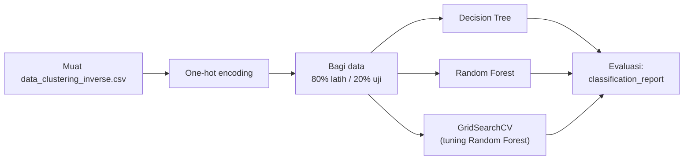
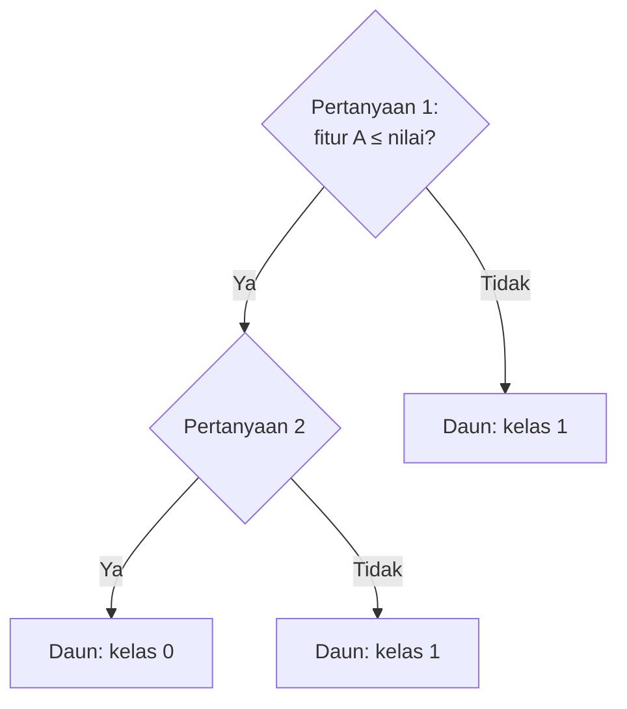
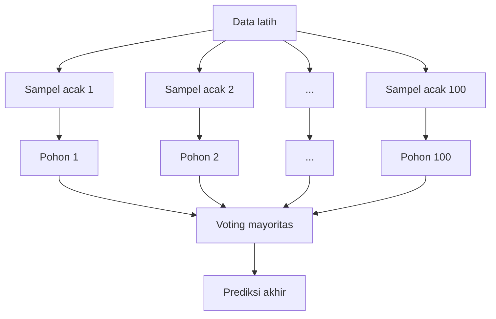

# Bab 7 — Bedah Notebook Klasifikasi

> **Inti bab ini:** kita menyusuri notebook `[Klasifikasi]_Submission_Akhir_BMLP_Andi_Arif_Abdillah.ipynb`. Kamu akan paham one-hot encoding, pembagian data, cara kerja Decision Tree dan Random Forest, cara membaca metrik, dan *hyperparameter tuning*. Di akhir, kita jawab pertanyaan besarnya: **kenapa akurasinya 100%?**

---

## 7.0 Gambaran Notebook



Tujuannya: membangun model yang bisa menebak `Target` (cluster 0 atau 1) untuk transaksi baru.

---

## 7.1 Import Library

```python
import pandas as pd
from sklearn.model_selection import train_test_split
from sklearn.tree import DecisionTreeClassifier
from sklearn.ensemble import RandomForestClassifier
from sklearn.metrics import accuracy_score, precision_score, recall_score, f1_score
from sklearn.model_selection import GridSearchCV, RandomizedSearchCV
from sklearn.metrics import classification_report
import joblib
```

Beberapa import (misalnya `accuracy_score` dan `RandomizedSearchCV`) disediakan template tapi tidak dipakai — template menyediakannya sebagai pilihan.

---

## 7.2 Memuat Data Hasil Clustering

```python
df = pd.read_csv("data_clustering_inverse.csv")
df.head()
```

Kenapa `data_clustering_inverse.csv`, bukan `data_clustering.csv`? Aturan template: kalau kriteria Advanced di bagian interpretasi diterapkan (membuat data inverse), maka klasifikasi **wajib** memakai data inverse.

Isi file ini: **1.945 baris × 11 kolom**, dengan nilai asli (bukan ter-*scale*) dan teks asli (bukan kode). Ada 5 kolom bertipe teks: `TransactionType`, `Location`, `Channel`, `CustomerOccupation`, `CustomerAge_Group`.

---

## 7.3 One-Hot Encoding

```python
categorical_cols = list(df.select_dtypes(include=['object']).columns)
df_encoded = pd.get_dummies(df, columns=categorical_cols, drop_first=True)
df_encoded.head()
```

**One-hot encoding** mengubah satu kolom kategori menjadi beberapa kolom berisi 0/1 (atau False/True), **satu kolom per kategori**:

| Channel | → | Channel_Branch | Channel_Online |
|---|---|:---:|:---:|
| ATM | | 0 | 0 |
| Branch | | 1 | 0 |
| Online | | 0 | 1 |

**Kenapa `drop_first=True`?** Kolom `Channel_ATM` dibuang karena informasinya sudah tersirat: kalau `Branch = 0` dan `Online = 0`, pasti ATM. Kategori yang dibuang (yang pertama menurut abjad) menjadi **kategori acuan** (*baseline*).

### One-hot vs LabelEncoder

| | LabelEncoder | One-hot encoding |
|---|---|---|
| Hasil | 1 kolom berisi 0, 1, 2, … | N−1 kolom berisi 0/1 |
| Menyiratkan urutan/jarak? | ⚠️ Ya (palsu untuk data nominal) | ✅ Tidak |
| Jumlah kolom | Tetap | Bertambah banyak |
| Cocok untuk | Data ordinal; model pohon | Data nominal; model berbasis jarak/linear |

Di sini **one-hot** dipakai — pilihan yang tepat untuk data nominal. Kalau saja one-hot juga dipakai di Notebook Clustering, masalah di Bab 6 tidak akan separah itu (lihat Bab 8).

**Jumlah fitur setelah one-hot:** 5 numerik + 50 kolom dummy = **55 fitur**.

| Kolom asli | Jumlah kategori | Kolom dummy (setelah `drop_first`) |
|---|---:|---:|
| TransactionType | 2 | 1 |
| Location | 43 | **42** |
| Channel | 3 | 2 |
| CustomerOccupation | 4 | 3 |
| CustomerAge_Group | 3 | 2 |
| **Total** | | **50** |

---

## 7.4 Membagi Data Latih dan Uji

```python
X = df_encoded.drop('Target', axis=1)
y = df_encoded['Target']

X_train, X_test, y_train, y_test = train_test_split(
    X, y,
    test_size=0.2,
    random_state=42,
    stratify=y
)
```

| Parameter | Arti |
|---|---|
| `drop('Target', axis=1)` | Buang **kolom** `Target` dari fitur (`axis=1` = kolom, `axis=0` = baris) |
| `test_size=0.2` | 20% data untuk uji |
| `random_state=42` | Pengacakan bisa diulang dengan hasil sama |
| `stratify=y` | Proporsi kelas di data latih & uji **dibuat sama** dengan data asli |

**Hasil:**

| | Total | Cluster 0 | Cluster 1 |
|---|---:|---:|---:|
| Seluruh data | 1.945 | 980 | 965 |
| Data latih | 1.556 | 784 | 772 |
| Data uji | 389 | 196 | 193 |

Tanpa `stratify`, bisa saja (karena kebetulan) data uji berisi terlalu banyak satu kelas, sehingga evaluasinya tidak adil.

---

## 7.5 Decision Tree

```python
decision_tree_model = DecisionTreeClassifier(random_state=42)
decision_tree_model.fit(X_train, y_train)
joblib.dump(decision_tree_model, 'decision_tree_model.h5')
```

### Cara kerja

Decision Tree membuat serangkaian **pertanyaan ya/tidak** yang memecah data menjadi kelompok-kelompok yang semakin "murni" (berisi satu kelas saja).



Untuk memilih pertanyaan terbaik di setiap langkah, pohon mengukur **ketidakmurnian** dengan **Gini impurity**:

$$
\text{Gini} = 1 - \sum_{k} p_k^2
$$

dengan $p_k$ = proporsi kelas *k* di sebuah kelompok.

- Kelompok **murni** (semua kelas 0): Gini = 1 − 1² = **0**.
- Kelompok **50:50**: Gini = 1 − (0,5² + 0,5²) = **0,5** (paling tidak murni untuk 2 kelas).

Di akar pohon proyek ini, data latih berisi 50,4% kelas 0 dan 49,6% kelas 1, sehingga Gini = **0,5**. Pohon lalu memilih pertanyaan yang **paling banyak menurunkan Gini**.

### Pohon yang terbentuk di proyek ini

Pohon yang sudah dilatih punya **kedalaman 21** dan **22 daun**. Dan **ke-21 pertanyaannya semuanya tentang kota**:

```
Apakah kota = Oklahoma City?  → Ya → Cluster 1
  Tidak → Apakah kota = Tucson?  → Ya → Cluster 1
    Tidak → Apakah kota = Virginia Beach?  → Ya → Cluster 1
      Tidak → Apakah kota = Mesa?  → Ya → Cluster 1
        Tidak → ... (17 kota lagi) ...
          Tidak → Cluster 0
```

Ke-21 kota yang ditanyakan **persis** adalah ke-21 kota Cluster 1 (Memphis sampai Washington). Kalau sebuah transaksi tidak berasal dari satu pun kota itu, pohon menyimpulkan Cluster 0.

Dengan kata lain, Decision Tree ini **menghafal daftar kota**. Itulah aturan yang dihasilkan K-Means (Bab 6), dan pohon berhasil menemukannya kembali dengan sempurna.

---

## 7.6 Random Forest (Skilled)

```python
new_model = RandomForestClassifier(random_state=42)
new_model.fit(X_train, y_train)
joblib.dump(new_model, 'explore_RandomForest_classification.h5')
```

Random Forest = **banyak Decision Tree yang bekerja sama** (di sini 100 pohon).



Dua sumber keacakan membuat pohon-pohonnya beragam:
1. **Bootstrap** — setiap pohon dilatih dengan sampel acak data latih (diambil *dengan pengembalian*).
2. **Fitur acak** — di setiap percabangan, pohon hanya boleh memilih dari sebagian fitur (`max_features='sqrt'` → sekitar √55 ≈ 7 fitur).

Hasilnya biasanya lebih **stabil** dan lebih tahan *overfitting* daripada satu pohon. Di proyek ini, fitur-fitur terpenting menurut Random Forest juga kolom `Location_*` (masing-masing sekitar 3%) — kepentingannya tersebar ke banyak kota karena setiap pohon hanya melihat sebagian fitur.

---

## 7.7 Membaca Metrik Evaluasi

```python
y_pred_dt  = decision_tree_model.predict(X_test)
y_pred_new = new_model.predict(X_test)
print(classification_report(y_test, y_pred_dt))
```

### Confusion matrix

Semua metrik berasal dari tabel ini (dengan Cluster 1 sebagai kelas "positif"):

| | Diprediksi 0 | Diprediksi 1 |
|---|---:|---:|
| **Sebenarnya 0** | TN (benar negatif) | FP (positif palsu) |
| **Sebenarnya 1** | FN (negatif palsu) | TP (benar positif) |

Hasil proyek ini di data uji:

| | Diprediksi 0 | Diprediksi 1 |
|---|---:|---:|
| **Sebenarnya 0** | 196 | 0 |
| **Sebenarnya 1** | 0 | 193 |

Tidak ada satu pun kesalahan.

### Rumus metrik

| Metrik | Rumus | Pertanyaan yang dijawab |
|---|---|---|
| **Accuracy** | $\frac{TP + TN}{\text{semua}}$ | Dari semua tebakan, berapa yang benar? |
| **Precision** | $\frac{TP}{TP + FP}$ | Dari yang **ditebak** kelas 1, berapa yang benar-benar kelas 1? |
| **Recall** | $\frac{TP}{TP + FN}$ | Dari yang **sebenarnya** kelas 1, berapa yang berhasil ditemukan? |
| **F1-Score** | $2 \times \frac{P \times R}{P + R}$ | Rata-rata harmonik precision & recall |

**Kapan precision lebih penting?** Ketika salah menuduh itu mahal (misalnya memblokir kartu nasabah yang tidak bersalah).
**Kapan recall lebih penting?** Ketika melewatkan kasus itu mahal (misalnya melewatkan transaksi penipuan).

### Membaca `classification_report`

```
              precision    recall  f1-score   support

           0       1.00      1.00      1.00       196
           1       1.00      1.00      1.00       193

    accuracy                           1.00       389
   macro avg       1.00      1.00      1.00       389
weighted avg       1.00      1.00      1.00       389
```

- Baris `0` dan `1`: metrik untuk masing-masing kelas.
- `support`: jumlah data uji yang **sebenarnya** termasuk kelas itu.
- `macro avg`: rata-rata biasa antar kelas (setiap kelas dianggap sama penting).
- `weighted avg`: rata-rata yang dibobot dengan `support` (kelas yang lebih banyak lebih berpengaruh).

Ketiga model (Decision Tree, Random Forest, hasil tuning) menghasilkan laporan yang **identik**: semuanya 1,00.

---

## 7.8 Hyperparameter Tuning dengan GridSearchCV (Advanced)

```python
params = {'n_estimators': [50, 100],
          'max_depth': [None, 10, 20],
          'min_samples_split': [2, 5]}

new_model_tuned = GridSearchCV(
    estimator=RandomForestClassifier(random_state=42),
    param_grid=params,
    cv=5,
    scoring='accuracy'
)
new_model_tuned.fit(X_train, y_train)
joblib.dump(new_model_tuned, 'tuning_classification.h5')
```

### Parameter vs hyperparameter

- **Parameter** = dipelajari model dari data (contoh: pertanyaan apa yang dipilih pohon).
- **Hyperparameter** = **diatur manusia sebelum** melatih (contoh: berapa banyak pohon, seberapa dalam).

| Hyperparameter | Arti | Nilai yang dicoba |
|---|---|---|
| `n_estimators` | Jumlah pohon | 50, 100 |
| `max_depth` | Kedalaman maksimum pohon (`None` = tanpa batas) | None, 10, 20 |
| `min_samples_split` | Jumlah data minimum agar sebuah simpul boleh dipecah | 2, 5 |

### Grid search + cross-validation

**Grid search** mencoba **semua kombinasi**: 2 × 3 × 2 = **12 kombinasi**.

Setiap kombinasi dinilai dengan **5-fold cross-validation**: data latih dibagi 5 bagian; model dilatih 5 kali, dan setiap kali satu bagian yang berbeda dipakai sebagai penguji.

```
Putaran 1: [UJI] [latih] [latih] [latih] [latih]
Putaran 2: [latih] [UJI] [latih] [latih] [latih]
Putaran 3: [latih] [latih] [UJI] [latih] [latih]
Putaran 4: [latih] [latih] [latih] [UJI] [latih]
Putaran 5: [latih] [latih] [latih] [latih] [UJI]
                    → skor = rata-rata 5 putaran
```

Total: 12 × 5 = **60 kali pelatihan**, ditambah 1 kali pelatihan ulang dengan kombinasi terbaik di seluruh data latih.

### Hasil tuning

| max_depth | min_samples_split | n_estimators | Skor CV |
|---|---:|---:|---:|
| None | 2 | 50 | **1,0000** |
| None | 2 | 100 | 0,9994 |
| None | 5 | 50 | **1,0000** |
| None | 5 | 100 | **1,0000** |
| 10 | 2 | 50 | 0,9897 |
| 10 | 2 | 100 | 0,9904 |
| 10 | 5 | 50 | 0,9897 |
| 10 | 5 | 100 | 0,9904 |
| 20 | 2 | 50 | **1,0000** |
| 20 | 2 | 100 | **1,0000** |
| 20 | 5 | 50 | **1,0000** |
| 20 | 5 | 100 | **1,0000** |

Yang menarik:
- **`max_depth = 10` sedikit lebih buruk (≈99%).** Ingat, satu pohon butuh kedalaman 21 untuk memeriksa ke-21 kota satu per satu. Pohon yang dibatasi kedalaman 10 tidak sempat memeriksa semuanya, dan voting antar pohon hanya menutupi sebagian besar kekurangan itu.
- **Tujuh kombinasi seri di 1,0000.** Kalau seri, GridSearchCV memilih yang muncul **pertama** dalam urutan pencarian: `max_depth=None, min_samples_split=2, n_estimators=50`.
- Tuning **tidak meningkatkan** akurasi di data uji (sudah 100% sebelumnya). Tugasnya terlalu mudah untuk diperbaiki.

---

## 7.9 Jadi, Kenapa Akurasinya 100%?

Bukan karena modelnya hebat, tapi karena **soalnya terlalu mudah**:

1. Label `Target` dibuat oleh K-Means, dan K-Means hanya membelah `Location` berdasarkan abjad (Bab 6).
2. Jadi `Target` **sepenuhnya ditentukan** oleh `Location` — sebuah aturan pasti tanpa pengecualian.
3. `Location` ikut menjadi fitur klasifikasi (sebagai 42 kolom dummy).
4. Setiap kota di data uji juga muncul di data latih.
5. Decision Tree cukup menghafal "21 kota mana yang termasuk Cluster 1".

| | Overfitting biasa | Yang terjadi di proyek ini |
|---|---|---|
| Akurasi data latih | Tinggi | 100% |
| Akurasi data uji | **Rendah** | 100% |
| Penyebab | Model menghafal *noise* | Aturannya memang sederhana & pasti |

Jadi ini **bukan overfitting**. Ini tugas yang bersifat **melingkar** (*circular*): model belajar menebak keputusan algoritma lain, dan keputusan itu hanya bergantung pada satu kolom yang juga diberikan ke model.

> 📌 **Pelajaran:** kalau akurasi 100%, jangan langsung senang. Tanyakan:
> *"Apakah ada fitur yang 'membocorkan' jawabannya?"* dan *"Apakah tugas ini memang terlalu mudah?"*

---

## 7.10 Bonus: Bagaimana dengan Kota yang Belum Pernah Dilihat?

Misalnya ada transaksi dari **Boise** (tidak ada di data latih). Setelah one-hot, semua 42 kolom `Location_*` bernilai 0. Pohon akan menjawab "tidak" untuk semua 21 pertanyaan kota, lalu memprediksi **Cluster 0**.

Model tidak error, tapi jawabannya tidak bermakna — ia hanya jatuh ke "kategori acuan". Ini mengingatkan bahwa model hanya bisa diandalkan untuk data yang **mirip dengan data latihnya**.

---

**← Sebelumnya:** [Bab 6 — Membaca Hasil Cluster dengan Jujur](06-membaca-hasil-cluster-dengan-jujur.md) · **Selanjutnya:** [Bab 8 — Eksperimen dan Perbaikan →](08-eksperimen-dan-perbaikan.md)
