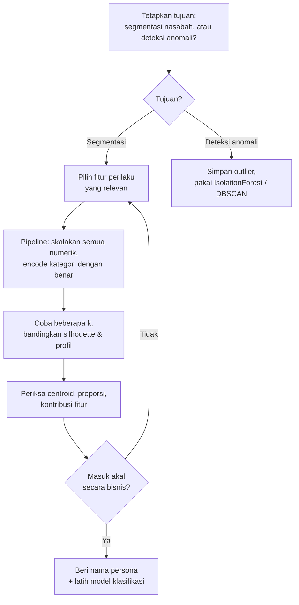

# Bab 8 — Eksperimen dan Perbaikan

> **Inti bab ini:** setelah tahu masalahnya (Bab 6), kita coba **cara lain** melakukan clustering dan membandingkan hasilnya dengan angka nyata. Kesimpulannya mungkin mengejutkan: **cluster yang paling bermakna justru punya Silhouette Score yang lebih rendah.**

Semua angka di bab ini bisa direproduksi dengan:

```bash
python belajar/eksperimen/verifikasi_dan_alternatif.py
```

> ⚠️ Eksperimen di bab ini **di luar template submission**. Template Dicoding melarang menambah import atau mengubah struktur. Kalau kamu ingin mencoba, lakukan di notebook atau skrip **terpisah**, jangan di notebook submission.

---

## 8.1 Titik Awal: Hasil Notebook

| | Nilai |
|---|---|
| Fitur yang dipakai | 10 (termasuk `Location` hasil LabelEncoder, tidak diskalakan) |
| Jumlah cluster | 2 |
| Silhouette | **0,572** |
| Bermakna? | ❌ Membagi kota berdasarkan abjad |

---

## 8.2 Eksperimen A — Hanya Fitur Perilaku Numerik

**Ide:** buang semua fitur kategorikal (termasuk biang masalahnya, `Location`), lalu cluster hanya berdasarkan 4 fitur numerik yang **benar-benar menggambarkan nasabah**, semuanya diskalakan:

`TransactionAmount`, `CustomerAge`, `TransactionDuration`, `AccountBalance`

(`LoginAttempts` tidak dipakai karena sudah konstan setelah pembuangan outlier.)

### Silhouette untuk berbagai k

| k | Silhouette |
|---:|---:|
| 2 | 0,242 |
| 3 | 0,244 |
| 4 | 0,238 |
| 5 | 0,252 |
| 6 | 0,232 |

Dua hal yang terlihat:
1. Silhouette **jauh lebih rendah** dari 0,572.
2. Nilainya **hampir sama** untuk semua k. Tidak ada k yang jelas paling baik.

Artinya, data ini **tidak punya kelompok alami yang tegas**. Nasabah tersebar secara kontinu — mirip dengan petunjuk di [Bab 4](04-mengenal-dataset.md#44-ringkasan-apa-yang-kita-ketahui-sebelum-memodelkan) (sebaran merata, korelasi lemah).

Dalam situasi seperti ini, memilih k bergantung pada **kebutuhan bisnis**: berapa segmen yang masuk akal untuk ditangani tim marketing atau risiko? Mari kita lihat k = 3.

### Profil cluster (k = 3)

| Cluster | Rata-rata nominal transaksi | Rata-rata umur | Rata-rata durasi | Rata-rata saldo | Jumlah |
|---|---:|---:|---:|---:|---:|
| **0** | **606,1** | 44,4 | 118,1 | 5.372,6 | 394 |
| **1** | 158,6 | **56,3** | 121,0 | **7.108,8** | 930 |
| **2** | 182,4 | **27,6** | 117,3 | **1.921,3** | 621 |

Sekarang kita bisa memberi nama yang **didukung angka**:

| Cluster | Persona | Alasan |
|---|---|---|
| 0 | **Pelaku transaksi besar** | Nominal rata-rata 3,3–3,8× lebih besar dari cluster lain (606 vs 159 dan 182) |
| 1 | **Nasabah senior bersaldo tinggi** | Paling tua (56 th) dan saldo paling besar (±7.100) |
| 2 | **Nasabah muda bersaldo rendah** | Paling muda (28 th) dan saldo paling kecil (±1.900) |

Persona cluster 1 dan 2 juga **konsisten** dengan satu-satunya korelasi berarti di data ini: umur ↔ saldo (0,32). Durasi transaksi hampir sama di ketiga cluster, jadi fitur itu tidak membedakan apa-apa.

> 💡 **Jujur tentang keterbatasan:** silhouette 0,24 berarti cluster-nya **saling tumpang tindih**. Ini lebih tepat disebut **segmentasi** (membagi sebuah spektrum menjadi beberapa wilayah yang berguna) daripada **penemuan kelompok alami**. Untuk keperluan bisnis, segmentasi seperti ini tetap berguna, asalkan kita tidak mengklaimnya sebagai kelompok yang "terpisah jelas".

---

## 8.3 Eksperimen B — Numerik Diskalakan + Kategorikal One-Hot

**Ide:** pertahankan semua fitur, tapi perlakukan dengan benar. Numerik diskalakan, kategorikal di-one-hot (bukan LabelEncoder). Total 56 fitur.

| k | Silhouette |
|---:|---:|
| 2 | 0,164 |
| 3 | 0,156 |
| 4 | 0,151 |
| 5 | 0,146 |
| 6 | 0,139 |

Silhouette-nya paling rendah. Kenapa?

- One-hot untuk `Location` menghasilkan **43 kolom** 0/1. Dua transaksi dari kota yang berbeda **selalu** berjarak √2 pada kolom-kolom itu, berapa pun kemiripan perilakunya.
- Dengan puluhan kolom biner seperti itu, jarak didominasi oleh "apakah kategorinya sama atau beda", sehingga perbedaan perilaku numerik tenggelam.

> 📌 **Pelajaran:** K-Means dirancang untuk data **numerik**. Untuk data campuran (numerik + kategorikal), ada metode yang lebih cocok seperti **K-Prototypes** (library `kmodes`) atau clustering dengan **jarak Gower**.

---

## 8.4 Perbandingan

| Pendekatan | Silhouette | Cluster bermakna? |
|---|---:|---|
| Notebook (LabelEncoder, Location tidak diskalakan) | **0,572** | ❌ Abjad nama kota |
| A — Numerik perilaku saja (k = 3) | 0,244 | ✅ Transaksi besar / senior kaya / muda bersaldo kecil |
| B — Numerik + one-hot | 0,164 | ⚠️ Didominasi kolom kategori |

> 🎯 **Pelajaran terbesar proyek ini:** Silhouette tertinggi justru milik hasil yang **paling tidak bermakna**. Metrik membantu membandingkan, tapi **tidak menggantikan** pemeriksaan "apakah ini masuk akal?".

---

## 8.5 Pola Kode yang Mencegah Kesalahan: `Pipeline` + `ColumnTransformer`

Akar masalah di notebook adalah **satu kolom terlupa diskalakan**. scikit-learn punya alat untuk mendeklarasikan perlakuan setiap kolom di satu tempat, sehingga tidak ada yang terlewat:

```python
from sklearn.compose import ColumnTransformer
from sklearn.pipeline import Pipeline
from sklearn.preprocessing import StandardScaler, OneHotEncoder
from sklearn.cluster import KMeans

numerik  = ["TransactionAmount", "CustomerAge", "TransactionDuration", "AccountBalance"]
kategori = ["TransactionType", "Channel", "CustomerOccupation"]

pra = ColumnTransformer([
    ("num", StandardScaler(), numerik),                       # semua numerik diskalakan
    ("cat", OneHotEncoder(handle_unknown="ignore"), kategori),  # semua kategori di-one-hot
])

pipa = Pipeline([
    ("pra", pra),
    ("kmeans", KMeans(n_clusters=3, random_state=42, n_init=10)),
])

label = pipa.fit_predict(df)                 # latih
label_baru = pipa.predict(data_baru)         # data baru otomatis diproses dengan cara yang sama
```

Keuntungannya:
- **Tidak ada kolom yang terlupa** — semua perlakuan tertulis eksplisit.
- **Data baru diproses persis sama** dengan data latih, tanpa menyalin langkah manual.
- `handle_unknown="ignore"` membuat kategori baru (misalnya kota yang belum pernah dilihat) tidak menyebabkan error.

> ⚠️ Pipeline mencegah kesalahan **teknis**, bukan kesalahan **interpretasi**. Hasil pipeline di atas tetap harus diperiksa dengan cara di Bab 6 (centroid, proporsi, kontribusi fitur) sebelum diberi nama persona.

---

## 8.6 Ide Perbaikan Lain

Ide-ide berikut **belum diuji** di proyek ini, tapi layak dicoba sebagai latihan:

| Masalah | Ide perbaikan |
|---|---|
| Outlier (nominal besar, login berulang) dibuang padahal itu sinyal fraud | Jangan dibuang; gunakan **deteksi anomali** seperti `IsolationForest`, `LocalOutlierFactor`, atau `DBSCAN` untuk menandainya |
| `dropna` membuang 15% data | **Imputasi** dengan `SimpleImputer` (median untuk numerik, modus untuk kategori) |
| Urutan Muda/Dewasa/Senior rusak oleh LabelEncoder | `OrdinalEncoder(categories=[["Muda", "Dewasa", "Senior"]])` |
| Kolom tanggal dibuang begitu saja | Buat fitur baru: **jam transaksi**, **hari dalam minggu**, **jumlah hari sejak transaksi sebelumnya** |
| `Location` punya 43 nilai | Kelompokkan jadi **wilayah** (misalnya timur/barat), pakai **frequency encoding**, atau buang kalau tidak relevan |
| K-Means kurang cocok untuk data campuran | **K-Prototypes** atau jarak **Gower** |
| Tidak tahu apakah cluster stabil | Ulangi clustering dengan `random_state` berbeda atau subsampel data, lalu bandingkan hasilnya |
| Tidak tahu apakah cluster berguna | Diskusikan dengan **ahli domain** (orang bank): apakah segmen ini bisa ditindaklanjuti? |

---

## 8.7 Kalau Mengulang Proyek Ini dari Awal

Langkah yang direkomendasikan:



Perhatikan bahwa langkah pertama adalah **menetapkan tujuan**. Proyek ini memakai dataset *fraud detection* tapi melakukan *segmentasi* — dan membuang data yang paling relevan untuk *fraud*. Kejelasan tujuan menentukan setiap keputusan sesudahnya.

---

**← Sebelumnya:** [Bab 7 — Bedah Notebook Klasifikasi](07-notebook-klasifikasi.md) · **Selanjutnya:** [Bab 9 — Glosarium dan Latihan →](09-glosarium-dan-latihan.md)
