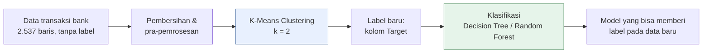

# 📚 Panduan Belajar: Memahami Proyek Ini dari Nol

Panduan ini ditulis supaya kamu **benar-benar paham proyek ini luar dalam** — bukan sekadar tahu *kode apa yang diketik*, tapi juga **kenapa** setiap langkah dilakukan, **apa artinya** setiap angka di output, dan **di mana kelemahannya**.

Semua angka di panduan ini adalah **angka asli** dari proyek ini (bukan contoh karangan), jadi kamu bisa mencocokkannya langsung dengan output di notebook.

---

## 🧭 Cara Memakai Panduan Ini

1. **Baca berurutan.** Setiap bab membangun di atas bab sebelumnya.
2. **Buka notebook di sebelahnya.** Saat bab 5 dan 7 membahas sebuah sel, lihat sel yang sama di notebook.
3. **Jangan lewati Bab 6.** Itu bab paling penting — di sana kita membongkar apa yang *sebenarnya* dipelajari model, dan hasilnya mengejutkan.
4. **Kerjakan latihan di Bab 9.** Kalau kamu bisa menjawab semuanya tanpa melihat, berarti kamu sudah paham.

---

## 📖 Daftar Isi

| Bab | Judul | Yang akan kamu pahami |
|-----|-------|------------------------|
| 1 | [Tujuan Proyek](01-tujuan-proyek.md) | Masalah apa yang diselesaikan, alur besar, dan apa yang *tidak* dilakukan proyek ini |
| 2 | [Fondasi Machine Learning](02-fondasi-machine-learning.md) | Fitur, label, supervised vs unsupervised, jarak, overfitting — dari nol |
| 3 | [Alat dan Lingkungan](03-alat-dan-lingkungan.md) | Python, Jupyter, pandas, scikit-learn, kenapa versi library penting |
| 4 | [Mengenal Dataset](04-mengenal-dataset.md) | 16 kolom data transaksi bank, kondisinya, dan kenapa pakai versi Google Sheets |
| 5 | [Bedah Notebook Clustering](05-notebook-clustering.md) | Setiap sel: pembersihan, encoding, outlier, scaling, K-Means, Silhouette, PCA |
| 6 | [Membaca Hasil Cluster dengan Jujur](06-membaca-hasil-cluster-dengan-jujur.md) | ⚠️ Apa yang *sebenarnya* membedakan kedua cluster (spoiler: nama kota) |
| 7 | [Bedah Notebook Klasifikasi](07-notebook-klasifikasi.md) | One-hot encoding, Decision Tree, Random Forest, metrik, GridSearchCV, kenapa akurasi 100% |
| 8 | [Eksperimen dan Perbaikan](08-eksperimen-dan-perbaikan.md) | Bagaimana cara membuat cluster yang lebih bermakna (dengan angka hasil eksperimen) |
| 9 | [Glosarium dan Latihan](09-glosarium-dan-latihan.md) | Kamus istilah + soal latihan bertingkat beserta jawabannya |

Skrip untuk mereproduksi angka di Bab 6 dan 8: [`eksperimen/verifikasi_dan_alternatif.py`](eksperimen/verifikasi_dan_alternatif.py)

---

## 🗺️ Peta Besar Proyek

**Bagian kiri (biru) = *unsupervised learning*.** Mesin mencari kelompok sendiri tanpa diberi tahu jawabannya.
**Bagian kanan (hijau) = *supervised learning*.** Mesin belajar dari jawaban (label) yang dihasilkan bagian kiri.

---

## ✅ Target Akhir

Setelah menyelesaikan panduan ini, kamu seharusnya bisa menjelaskan — dengan kata-katamu sendiri:

- [ ] Kenapa proyek ini butuh **dua** tahap (clustering lalu klasifikasi)
- [ ] Apa yang dilakukan setiap langkah pra-pemrosesan dan **kenapa urutannya penting**
- [ ] Bagaimana K-Means bekerja dan bagaimana memilih jumlah cluster
- [ ] Apa arti Silhouette Score 0,57 — dan kenapa angka bagus itu **bisa menyesatkan**
- [ ] Kenapa model klasifikasi mendapat akurasi 100%, dan kenapa itu **bukan** prestasi
- [ ] Apa yang akan kamu lakukan berbeda jika mengulang proyek ini
